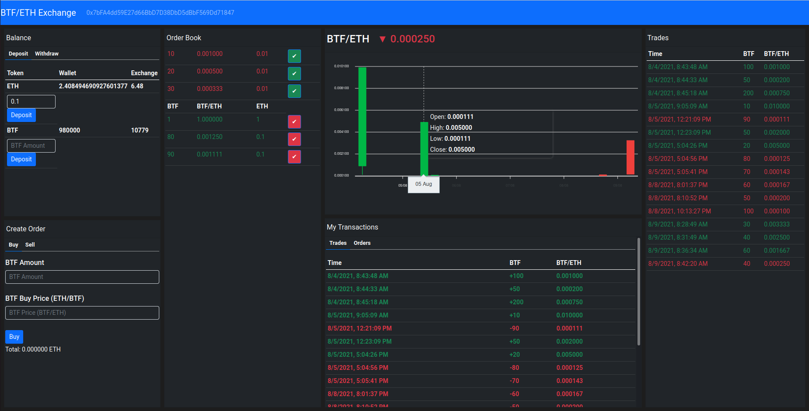

# BTF/ETH Exchange

This project is a decentralized exchange based on Ethereum for buying and
selling an ERC-20 token called BTF. The project includes the smart contract and
the frontend client to interact with the smart contract.

The project is based on the [Dapp University
Bootcamp](https://www.dappuniversity.com/) and includes some of the new React
functionalities such as Hooks. The state management through Redux is done
slightly in oder way with a smaller load on the reducers.

The exchange enables:

1. Deposit and withdraw Ether
2. Deposit and withdraw the BTF ERC-20 token
3. Create buying and selling orders
4. Execute open orders 
5. See your orders (pending and filled)
6. Cancel your open orders
7. See the price BTF/ETH at any moment 

# Dependencies

You will need the [Metamask](https://metamask.io/) plugin on your browser in
order to administrate your private keys.
